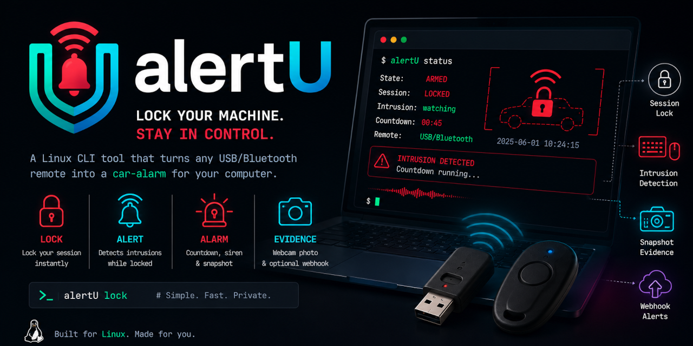

<p align="center">
  
</p>

# AlertU

A Linux re-imagining of the old Mac **iAlertU**: a cheap USB/Bluetooth HID remote
becomes the "key fob" for a car-alarm-style guard on your computer. Click to arm
(the session locks with a chirp); anyone who touches the keyboard or mouse while
it's armed trips a countdown, and if you don't disarm in time it wails a siren and
snaps a webcam photo of whoever it is.

It is a **personal gadget**, not an anti-theft system — see the threat-model note
below.

## How it works

```
        click remote / force-arm
Idle ───────────────────────────► Armed ──(session locked, watching inputs)
 ▲                                  │
 │ click remote, or                 │ input activity after grace period
 │ password unlock                  ▼
 │                              Triggered ──(countdown + quiet warning tick)
 │  password unlock / click         │
 ├──────────────────────────────────┤ countdown expires
 │                                  ▼
 └──────────────────────────────── Alarm ──(siren loop + webcam snapshot + webhook)
```

* **Arm** — a click on the remote's button locks the session
  (`loginctl lock-session`) and plays a short chirp.
* **Disarm** — whichever comes first wins: another click on the remote, or a
  normal password unlock (detected by polling the session's `LockedHint`).
* **Intrusion** — while armed, any activity on the watched input devices
  (everything except the remote and the main mouse, by default) moves to
  `Triggered`.
* **Countdown** — an adjustable `alarm_delay_secs` runs with a discreet warning
  tick. Unlock in time and everything resets to `Idle`; otherwise the siren
  loops, a timestamped webcam snapshot is saved, and the optional webhook fires.

### Generic remote support

Nothing is hardcoded to a specific model. Any USB/Bluetooth device that shows up
as a standard HID node under `/dev/input/eventX` works — you pick the remote and
the watched devices from the tray. The reference device is an **AB Shutter 3**
(AIROHA AB1126A) that enumerates as a keyboard sending `KEY_VOLUMEUP` or
`KEY_ENTER`, but `toggle_keys` accepts any evdev key name, resolved generically
via evdev's `KeyCode` name table.

## Architecture

One privileged daemon owns the state; every front end talks to it over a local
Unix socket (`/run/alertu/alertu.sock`, newline-delimited JSON):

| Crate | Binary | Role |
|-------|--------|------|
| `alertu-common` | — | Shared config, state enum, and IPC protocol (plus a blocking socket client behind the `ipc-client` feature). |
| `alertu-daemon` | `alertu-daemon` | Privileged: evdev reading, the state machine, session lock/unlock, audio, snapshots, webhook, `/dev/input` hotplug. |
| `alertu-gui` | `alertu-gui` | Per-session tray (StatusNotifierItem via `ksni`) reflecting state, with quick device selection and settings in its menu. Survives a daemon restart: the icon stays put, the tooltip reads "Daemon offline" and the action items grey out until it reconnects. |
| `alertu-settings` | `alertu-settings` | Standalone settings window (egui/eframe) for full config editing; launched from the tray's "Open settings…" item. Reconnects transparently if the daemon restarts under it. |
| `alertu-ctl` | `alertu-ctl` | Command line: arm/disarm/toggle, state, config and devices — scriptable, with a `--json` mode. |

The daemon is the only component that touches `/dev/input` and the webcam, so it
also enumerates devices and reports them to the GUI over IPC — the GUI needs no
special privileges. It watches `/dev/input` with inotify, so plugging or
unplugging a device re-resolves the remote/watch readers and pushes an updated
device list to the tray automatically (no manual refresh needed).

### State machine

A single task owns all mutable state and drives transitions from four multiplexed
sources: input signals (remote/intrusion), session lock-state changes (password
unlock), IPC control commands, and internal timers (the countdown and warning
ticks). See `crates/alertu-daemon/src/machine.rs`.

## Build

```sh
cargo build --release
# binaries: target/release/{alertu-daemon,alertu-gui,alertu-settings,alertu-ctl}
cargo test --workspace   # unit tests (config, device resolution, key parsing,
                         # CLI rendering) plus integration tests that drive a
                         # real daemon over its socket with a fake `loginctl`
cargo test --workspace --all-features   # also the feature-gated IPC client tests
```

Requires a recent stable Rust toolchain. The daemon, the tray and `alertu-ctl`
need no system dev libraries: the tray uses pure-Rust `zbus` (no `libdbus`), and
audio/snapshot/webhook shell out to external tools rather than linking C
libraries. Only `alertu-settings` pulls in build dependencies, because
egui/eframe links against X11/Wayland/GL — see the `apt-get install` list in
[`.github/workflows/ci.yml`](.github/workflows/ci.yml) for the exact packages.
Skip it with `cargo build --release --workspace --exclude alertu-settings` if you
would rather not install them.

## Install (systemd)

```sh
sudo install -Dm755 target/release/alertu-daemon   /usr/local/bin/alertu-daemon
sudo install -Dm755 target/release/alertu-ctl      /usr/local/bin/alertu-ctl
install  -Dm755 target/release/alertu-gui           ~/.local/bin/alertu-gui
install  -Dm755 target/release/alertu-settings      ~/.local/bin/alertu-settings
# Dedicated daemon account, in the groups it needs for /dev/input and the webcam.
sudo systemd-sysusers packaging/sysusers.d/alertu.conf
# (equivalent one-liner: sudo useradd --system --groups input,video alertu)

sudo install -Dm644 packaging/config.example.toml /etc/alertu/config.toml
sudo install -Dm644 packaging/alertu-daemon.service /etc/systemd/system/alertu-daemon.service

# Before starting the daemon, so its first arm does not chirp into missing files.
sudo alertu-ctl gen-sounds --dir /usr/share/sounds/alertu

sudo systemctl enable --now alertu-daemon

install -Dm644 packaging/alertu-gui.service ~/.config/systemd/user/alertu-gui.service
systemctl --user enable --now alertu-gui

# Application icon and menu entry for the settings window.
for s in 48 64 128 256 512; do
  install -Dm644 "packaging/icons/hicolor/${s}x${s}/apps/alertu.png" \
    ~/.local/share/icons/hicolor/${s}x${s}/apps/alertu.png
done
install -Dm644 packaging/alertu-settings.desktop \
  ~/.local/share/applications/alertu-settings.desktop
gtk-update-icon-cache -f -t ~/.local/share/icons/hicolor 2>/dev/null || true
```

Make sure one of `fswebcam`/`ffmpeg` (snapshots) and one of
`paplay`/`pw-play`/`aplay`/`ffplay`/`play` (audio) are installed.

## Command line

`alertu-ctl` does everything the tray does, from a shell or a script:

```sh
alertu-ctl gen-sounds --dir /usr/share/sounds/alertu   # write the default sounds
alertu-ctl status              # Idle | Armed | Triggered | Alarm
alertu-ctl arm                 # force-arm (locks the session)
alertu-ctl disarm              # force-disarm (unlocks it)
alertu-ctl toggle              # exactly what a remote click does
alertu-ctl get-config          # the daemon's effective config, as TOML
alertu-ctl set-config c.toml   # replace it (`-` reads stdin); validated locally first
alertu-ctl list-devices        # the input devices the daemon can see

alertu-ctl --json status       # {"event":"state","state":"idle"}
alertu-ctl status --watch      # one line per state change, until interrupted
alertu-ctl --json status --watch | while read -r line; do ...; done
```

`--json` prints the daemon's raw protocol response, so a watched transition
arrives as `{"event":"state_changed","state":"armed"}` and is distinguishable
from the initial snapshot. `-s/--socket` points at a non-default socket. Exit
codes: `0` success, `1` daemon or connection error, `2` usage error.

## Configuration

TOML, loaded at daemon startup and editable live from the tray. See
[`packaging/config.example.toml`](packaging/config.example.toml) for every field
with inline docs. Highlights: `remote_device`/`remote_name_hint`, `toggle_keys`,
`watch_devices` (`["auto"]` or explicit paths), `grace_period_secs`,
`alarm_delay_secs`, the three sound paths, `snapshot_dir`/`camera_device`, and
the optional `alarm_webhook_url`.

## Platform

Linux with systemd. Works across X11 and Wayland because it only uses
`logind`/`loginctl` — no dependency on a specific compositor or desktop.

**Groups.** It is the *daemon's* account that needs `input` (to read
`/dev/input/event*`, which is `root:input` mode `0660`) and `video` (webcam
capture). The systemd install above creates that account already in both, so
your own login needs no group change: the tray, the settings window and
`alertu-ctl` only speak to the socket and touch no device directly.

The exception is running the daemon **by hand** — during development, or to
identify a new remote — in which case whoever launches it needs `input` too:

```sh
sudo usermod -aG input "$USER"   # then start a new session, or use `newgrp input`
```

## Deliberate scope & design choices

* **Audio and snapshots shell out** to external tools (`paplay`/`ffplay`/…,
  `fswebcam`/`ffmpeg`). This keeps the daemon free of ALSA/PulseAudio and camera
  build dependencies and matches the spec's choice to shell out for capture. The
  `sound` module is a thin wrapper, so swapping in `rodio` later is localized.
* **Two levels of GUI.** The tray (StatusNotifierItem, pure-Rust `zbus`) offers
  quick device selection and delay tweaks right in its menu — no GTK/Qt needed.
  For full editing there's a standalone `alertu-settings` window built with
  egui/eframe (self-contained, no GTK/Qt either), launched from the tray's
  "Open settings…" item. Both edit the same config live over the socket.
* **The webhook is the only forward-looking hook** kept in scope (v1 has no full
  mobile pairing), fired via `curl` so there's no HTTP/TLS client dependency.

### Threat-model note

This is a personal convenience gadget, not a hardened security product. The IPC
socket is created world-connectable (`0o666`) so a normal desktop session can
reach the root/`alertu`-owned daemon; there is no binary anti-tampering. Don't
rely on it as a real anti-theft mechanism.

## License

MIT — see [LICENSE](LICENSE).
